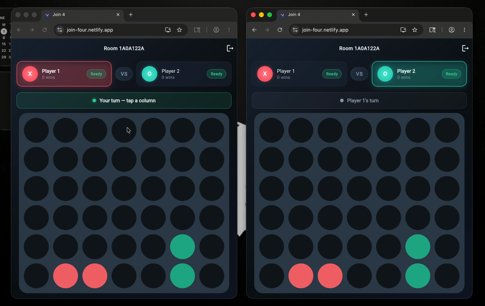

# Join4

A realtime multiplayer Connect Four-style game built entirely with Dart.

## Demo

Play the game live at https://join-four.netlify.app/

## About

Join4 is a multiplayer, realtime board game where two players drop discs into a vertical grid and try to connect four in a row. Players can join an active room, watch the board update in realtime, and compete across a live WebSocket connection.

## Architecture

- Frontend: Flutter handles the UI, game board, player cards, lobby, and realtime updates.
- Backend: Dart Frog powers the realtime game server and WebSocket communication.

This project uses Dart for both the client and server, making it a full-stack Dart application.

## Key features

- Realtime multiplayer gameplay using WebSockets
- Lobby and room management
- Responsive Flutter UI for web and mobile targets
- Shared Dart code and models for frontend/backend consistency